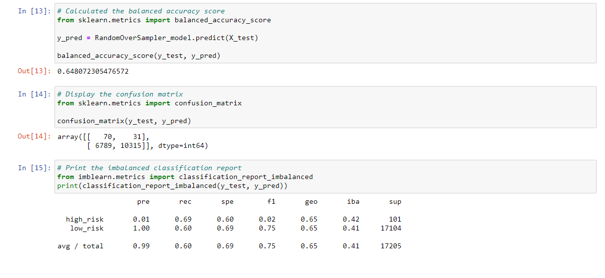
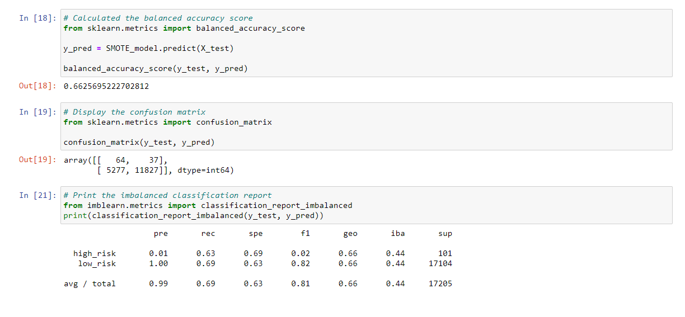
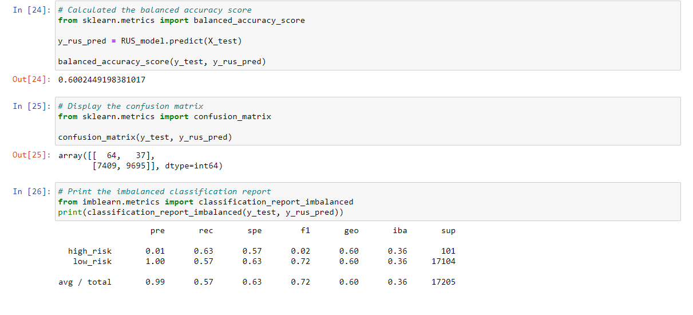
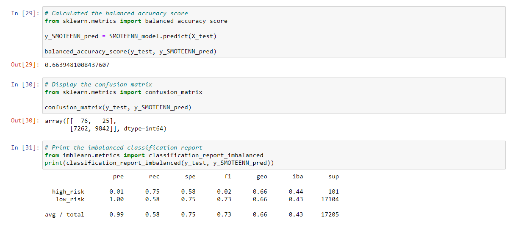
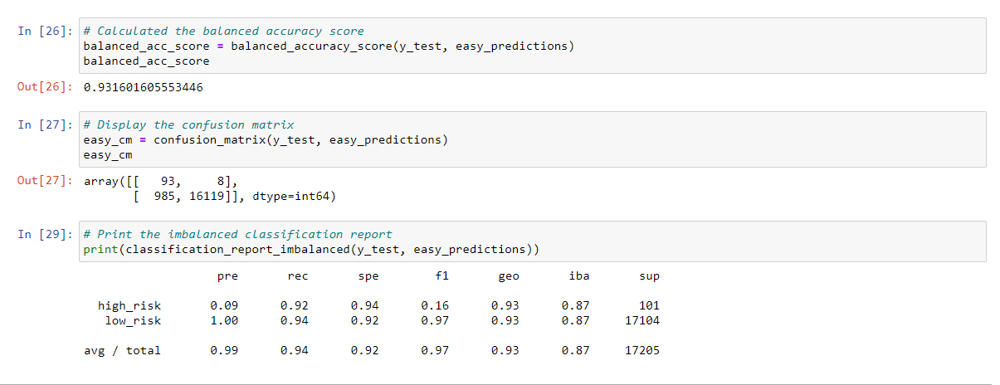

# Credit Risk Analysis

## **Overview of Analysis:**
The purpose of this analysis was to apply various machine learning techniques to determine credit risk in a credit card dataset from LendingClub. This project used the imbalanced-learn and scikit-learn libraries to apply several algorithms to the dataset in order to predect the best outcome for the client. 

## **Results:**
Please observe the folling results from the tested algorithms: 

### 1. Naive Random Oversampling:

  

  

### 2. SMOTE Oversampling:

  

### 3. Undersampling:

  

### 4. SMOTEENN (Combination sampling):

  

### 5. Balanced Random Forest Classifier:

  

### 6. Easy Ensemble AdaBoost Classifier:

  