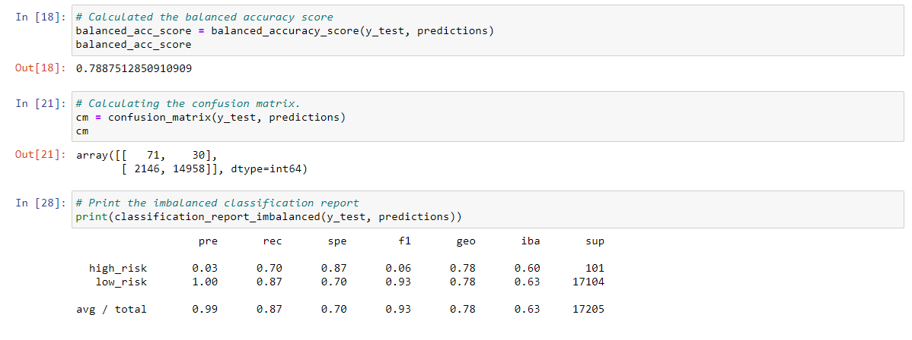

# Credit Risk Analysis

## **Overview of Analysis:**
The purpose of this analysis was to apply various machine learning techniques to determine credit risk in a credit card dataset from LendingClub. This project used the imbalanced-learn and scikit-learn libraries to apply several algorithms to the dataset to predict the best outcome for the client. 

## **Results:**
Please observe the following results from the tested algorithms: 

### 1. Naive Random Oversampling:

 
The accuracy score for Random Oversampling sits at 64%, with a precision of 99%, a sensitivity of 60%, and an F1 score of 75%. 
  

### 2. SMOTE Oversampling:

 
The accuracy score for SMOTE Oversampling sits at 66%, with a precision of 99%, a sensitivity of 69%, and an F1 score of 81%. 
  

### 3. Undersampling:

 
The accuracy score for Random Undersampling sits at 60%, with a precision of 99%, a sensitivity of 57%, and an F1 score of 72%. 
  

### 4. SMOTEENN (Combination sampling):

 
The accuracy score for SMOTEENN sits at 66%, with a precision of 99%, a sensitivity of 58%, and an F1 score of 73%. 
  

### 5. Balanced Random Forest Classifier:

 
The accuracy score for Balanced Random Forest Classifier sits at 78%, with a precision of 99%, a sensitivity of 87%, and an F1 score of 93%. 
  

### 6. Easy Ensemble AdaBoost Classifier:

 
The accuracy score for Easy Ensemble AdaBoost Classifier sits at 93%, with a precision of 99%, a sensitivity of 94%, and an F1 score of 97%. 
  

## **Summary:**
The results above show a clear winner in the algorithms. The Easy Ensemble AdaBoost Classifier achieved the high results on accuracy, precision, sensitivity, and F1 score. By combining multiple weak classifiers and giving the weight to create a strong classifier, the adaptive boosting can be more accurate in its predictions. It would be advisable to use this algorithm for future predictions of credit risk.
